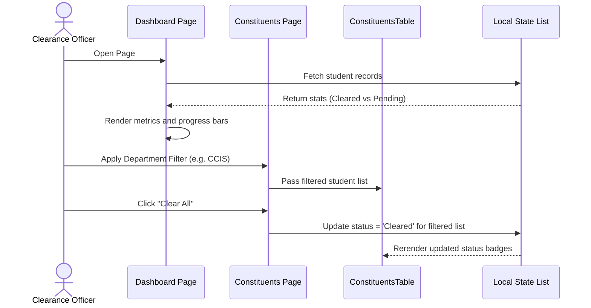
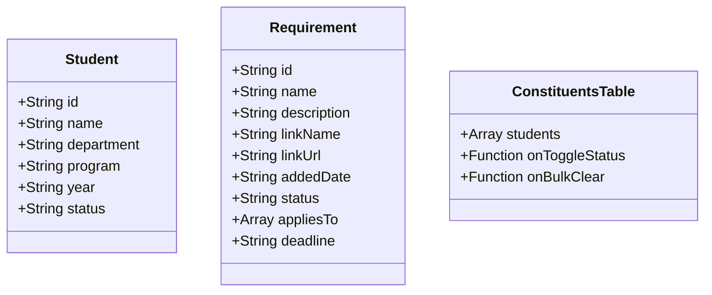

# Module 1: Head Office Module

## 1. Module Overview
The Head Office Module provides the administrative workspace for college clearance officers (e.g. Registrar, Library, Guidance, Accounting) to oversee and manage the clearance processes of the entire student body. It combines four key operational areas:

1. **Dashboard & Analytics**: Real-time overview counters representing total students, cleared/pending counts, overall clearance progress, and dynamic progress bars.
2. **Requirements Management**: Listing, creating, editing, and publishing clearance checklists, targeted at specific student demographics (departments, programs, year levels).
3. **Constituents Directory**: An interactive table of student clearance profiles supporting search, filters, individual status toggles, and bulk "Clear All" / "Reset All" operations.
4. **Reports & Metrics Exporter**: Generating and exporting detailed Excel spreadsheets and CSV files of student clearance statistics and data lists.

Its defining design elements are **balanced spacing, safety validations, and clear state visualization**: tables use custom grid layouts to align headers and rows, critical requirement changes are guarded by confirmation overlays, and student profiles are represented by distinct, color-coded status badges.

---

## 2. Objectives
* Give clearance officers authoritative control over global university clearance checklists.
* Provide an interactive, high-performance data grid that allows filtering, sorting, and bulk-clearing student records.
* Maintain real-time statistical accuracy for clearance rates (cleared vs. pending) on the officer dashboard.
* Enable Excel/CSV data exports to support offline auditing and administrative reviews.
* Guard against accidental global requirements modification through interactive confirmation dialog overlays.

---

## 3. Features

| Feature | Explanation |
| :--- | :--- |
| **Overview Dashboard** | Real-time counters showing Total Roster, Cleared Students, Pending Audits, and overall percentage progress. |
| **Requirements Management** | Full CRUD capabilities for configuring clearance checklist items with dynamic titles, descriptions, and optional deadlines. |
| **Form Link Attachment** | Attaching verification URLs or external documents (e.g. Google evaluation sheets) to any requirement. |
| **Demographics targeting** | Selecting target student demographics (departments, programs, year levels) using the custom `AppliesToSelector` popover. |
| **Draft / Live Publishing** | Switch requirement state between Draft (internal configuration) and Live (visible to targeted students). |
| **Constituents Table** | A comprehensive data grid listing student names, IDs, departments, year levels, and clearance status. |
| **Bulk Clearance Actions** | Perform bulk updates (e.g. "Clear All Eligible" or "Reset All Statuses") across filtered student lists. |
| **Excel/CSV Export** | Export student clearance records directly into standard formats including statistics summaries. |
| **Safe Submit Guards** | Dialog intercepts preventing requirement saves or edits until confirmed by the officer. |

---

## 4. User Roles

| Role | Responsibilities within this module |
| :--- | :--- |
| **HEAD_OFFICE_OFFICER** | Administer clearance requirements, perform student audits, validate clearances (individual/bulk), and download reports. |
| **STUDENT** | View clearance requirements and status, access links, and track deadlines. |

---

## 5. Functional Responsibilities
* **Data creation** — Instantiating requirement records (global/office-bound) and logging clearance audit records.
* **Data updates** — Requirement edits, status toggles (Draft ↔ Live), individual/bulk student status toggles (Cleared ↔ Pending).
* **Validation** — Mandatory field checks, URL format checking, and verifying bulk operations permissions.
* **Approval processes** — Student verification audits, confirmation guard triggers on requirement saves/edits.
* **Status management** — Student clearance states (Cleared | Pending) and requirement states (Live | Draft).
* **Reporting & Display** — Generating Excel spreadsheets and CSV lists, calculating clearance percentage progress.
* **Error handling** — Graceful fallbacks for missing links ("No link"), missing deadlines ("No deadline"), and empty search query results.

---

## 6. Components

| Component | Type | Purpose |
| :--- | :--- | :--- |
| **Head Office Dashboard** | Next.js Client Page | Renders metric cards, progress bars, and stats ([app/head-office/dashboard/page.tsx](file:///c:/Users/surig/Documents/Development%20Poject/Clearance_System/Clearance-System/app/head-office/dashboard/page.tsx)). |
| **Requirements Manager** | Next.js Client Page | Core workspace for defining requirements ([app/head-office/clearance-requirements/page.tsx](file:///c:/Users/surig/Documents/Development%20Poject/Clearance_System/Clearance-System/app/head-office/clearance-requirements/page.tsx)). |
| **Constituents Directory** | Next.js Client Page | The interactive student roster ([app/head-office/constituents/page.tsx](file:///c:/Users/surig/Documents/Development%20Poject/Clearance_System/Clearance-System/app/head-office/constituents/page.tsx)). |
| **Reports Exporter** | Next.js Client Page | UI for generating and downloading reports ([app/head-office/reports/page.tsx](file:///c:/Users/surig/Documents/Development%20Poject/Clearance_System/Clearance-System/app/head-office/reports/page.tsx)). |
| **AppliesToSelector** | Reusable UI Component | Handles multi-selection popovers, search filtration, and target locking ([components/ui/AppliesToSelector.tsx](file:///c:/Users/surig/Documents/Development%20Poject/Clearance_System/Clearance-System/components/ui/AppliesToSelector.tsx)). |
| **ConfirmationDialog** | Reusable UI Component | Dialog overlay prompting confirmation before saving modifications ([components/ui/ConfirmationDialog.tsx](file:///c:/Users/surig/Documents/Development%20Poject/Clearance_System/Clearance-System/components/ui/ConfirmationDialog.tsx)). |
| **ConstituentsTable** | Reusable UI Component | Renders the data grid for student rosters ([components/ConstituentsTable.tsx](file:///c:/Users/surig/Documents/Development%20Poject/Clearance_System/Clearance-System/components/ConstituentsTable.tsx)). |
| **ConstituentsFilterBar** | Reusable UI Component | Manage filters, search fields, and bulk controls ([components/ConstituentsFilterBar.tsx](file:///c:/Users/surig/Documents/Development%20Poject/Clearance_System/Clearance-System/components/ConstituentsFilterBar.tsx)). |

---

## 7. Workflow

### 7.1 Clearance Auditing (Constituents)
1. **Officer opens directory**: Renders student roster. Officer uses search bar or filter dropdowns (department, program, status) to scope students.
2. **Single update**: Officer clicks a student's status badge. This toggles state from Cleared ↔ Pending and updates dashboard counters.
3. **Bulk update**: Officer selects a filter and clicks "Clear All Eligible" or "Reset All Statuses". The table executes bulk updates across all filtered items.

### 7.2 Requirements Management
1. **Create requirement**: Officer opens modal, configures appliesTo tags via `AppliesToSelector`, inputs optional link and deadline date.
2. **Submit intercept**: Officer clicks save; the application intercepts and presents the custom `ConfirmationDialog`.
3. **Confirmation**: Clicking "Confirm" saves requirement to list table using a centered grid layout.

---

## 8. Business Rules
* **Draft vs Live**: Requirement is invisible to targeted students unless toggled to "Live".
* **Table Spacing Rules**: Requirement tables use a custom grid template (`grid-cols-[3fr_1fr_1fr_1fr_1fr_1fr]`) to keep Link, Added, Deadline, Status, and Actions equally wide (12.5% each).
* **Muted Fallbacks**: Missing links show a grayed out `"No link"` label with a `link_off` icon. Missing deadlines show `"No deadline"`.

---

## 9. Module Interaction

| Related Module | Purpose | Data Exchanged | Trigger |
| :--- | :--- | :--- | :--- |
| **Authentication Module** | Session & context binding | Active role, office restrictions | Page load & user authentication |
| **Constituents Directory** | Mapping student checklists | Requirement criteria tags (`appliesTo`) to filter student eligibility lists | Status updates & query filters |
| **Student Dashboard** | Requirement lookups | Live requirements list, deadlines, and link attachments | Student dashboard rendering |

---

## 10. Sequence Diagram

---

## 11. Class Design

---

## 12. Security Considerations
* **Role Enforcement**: Session validation ensures only accounts flagged with `HEAD_OFFICE_OFFICER` permissions can perform write/toggle operations.
* **CSRF & CORS Guards**: State-changing audit actions require originating from a trusted domain using HTTPOnly cookies.

---

## 13. Design Considerations
* **Symmetry & Alignment**: The custom CSS grid template (`grid-cols-[3fr_1fr_1fr_1fr_1fr_1fr]`) ensures perfect centering of all table columns.
* **Frosted Glass Effects**: Modals and confirmation dialogs utilize `backdrop-blur-sm` to create visual depth and focus attention on the active prompt.

---

## 14. Future Enhancements
* **Database Persisted Logics**: Connecting standard clearance templates to database schemas to automate validation rules.
* **Auto-generated Deadlines**: Automated emails warning students when a clearance deadline is approaching.
