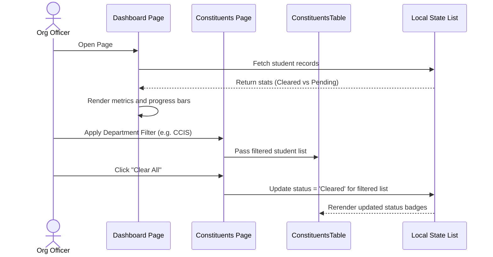
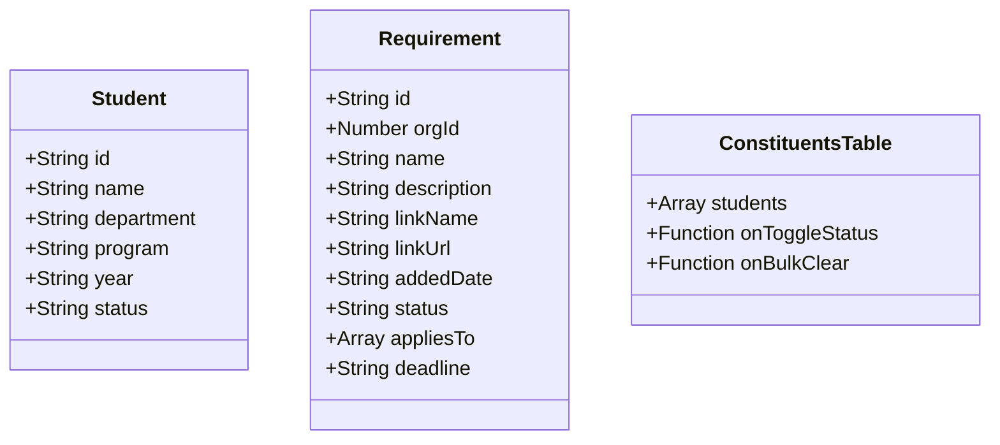

# Module 2: Organization Module

## 1. Module Overview
The Organization Module provides the workspace for student organization leaders, advisers, and local student councils (e.g. Student Government, LGUs, Academic Clubs, Non-Academic Clubs) to define, track, and validate student clearance checklists. It combines five key operational areas:

1. **Multi-Org Selector & Login Binding**: Displays on login to session-bind the selected organization, setting active roles and restrictions.
2. **Dynamic Sidebar & Navigation Layout**: Renders logo initials, organization category tags, and adviser details dynamically on page load.
3. **Dashboard & Analytics**: Real-time overview counters representing total students, cleared/pending counts, overall clearance progress, and dynamic progress bars.
4. **Requirements Manager**: Component for listing, adding, editing, and publishing clearance requirements, with department-level and program-level exclusive locks.
5. **Org Constituents Page**: Aligned search parameters, status toggles, and locked filter dropdowns for exclusive org roles.
6. **Reports & Metrics Exporter**: Component for exporting clearance compliance metrics and filtered reports.

Its defining design element is **scope locking, safety validation, and grid symmetry**: LGUs and Academic Clubs have their targeting locked to their own departments/programs via the reusable `AppliesToSelector`, requirement changes are guarded by a custom `ConfirmationDialog` overlay, and tables use custom grid layout structures to align headers and rows.

---

## 2. Objectives
* Enable student organization leaders to create targeted clearance checklists.
* Enforce exclusive targeting scopes at the interface level based on organization details.
* Standardize link attachments (e.g. membership forms or external links) with muted visual fallbacks.
* Support dynamic, multi-select targeting criteria without affecting database models.
* Prompt for confirmation before applying changes to prevent accidental checklist modifications.

---

## 3. Features

| Feature | Explanation |
| :--- | :--- |
| **Overview Dashboard** | Real-time counters showing Total Roster, Cleared Students, Pending Audits, and overall percentage progress. |
| **Requirements Management** | Full CRUD capabilities for configuring clearance checklist items with dynamic titles, descriptions, and optional deadlines. |
| **Exclusive Targeting Locks** | Automatically restricts targeting scopes for LGUs (locked to department) and Academic Clubs (locked to program). |
| **Form Link Attachment** | Attaching verification URLs or external documents (e.g. Google evaluation sheets) to any requirement. |
| **Clearance Deadlines** | Optional due date configuration setting a deadline for student compliance. |
| **Draft / Live Publishing** | Switch requirement state between Draft (internal configuration) and Live (visible to targeted students). |
| **Constituents Table** | A comprehensive data grid listing student names, IDs, departments, year levels, and clearance status. |
| **Bulk Clearance Actions** | Perform bulk updates (e.g. "Clear All Eligible" or "Reset All Statuses") across filtered student lists. |
| **Excel/CSV Export** | Export student clearance records directly into standard formats including statistics summaries. |
| **Safe Submit Guards** | Dialog intercepts preventing requirement saves or edits until confirmed by the officer. |

---

## 4. User Roles

| Role | Responsibilities within this module |
| :--- | :--- |
| **ORGANIZATION_OFFICER** | Define organization-specific checklists, attach forms/links, set deadlines, and toggle draft/live status under exclusive scope locks. |
| **STUDENT** | Read-only access: view active Live organization requirements and deadlines, and launch attached forms. |

---

## 5. Functional Responsibilities
* **Data creation** — Instantiating requirement rows bound to the organization's session ID, including customized appliesTo arrays.
* **Data updates** — Requirement edits, status toggles (Draft ↔ Live), and individual/bulk student status toggles (Cleared ↔ Pending).
* **Validation** — Mandatory field validations (e.g. Requirement Name), URL schema validations, and exclusive scope lock enforcement.
* **Approval processes** — Intercepting creation and edits with custom confirmation dialog overlays before final state changes are saved.
* **Status management** — Draft ↔ Live state machine controlling visibility, and student clearance states (Cleared | Pending).
* **Reporting & Display** — Centered and balanced data presentation highlighting deadline dates and link states.
* **Error handling** — Fallback text (e.g. "No deadline" or "No link" placeholders) rendered cleanly to prevent visual layout breakage.

---

## 6. Components

| Component | Type | Purpose |
| :--- | :--- | :--- |
| **Organization Dashboard** | Next.js Client Page | Renders metric cards, progress bars, and stats ([app/org/dashboard/page.tsx](file:///c:/Users/surig/Documents/Development%20Poject/Clearance_System/Clearance-System/app/org/dashboard/page.tsx)). |
| **Organization Requirements Page** | Next.js Client Page | Core workspace for defining requirements ([app/org/clearance-requirements/page.tsx](file:///c:/Users/surig/Documents/Development%20Poject/Clearance_System/Clearance-System/app/org/clearance-requirements/page.tsx)). |
| **Org Constituents Page** | Next.js Client Page | The interactive student roster ([app/org/constituents/page.tsx](file:///c:/Users/surig/Documents/Development%20Poject/Clearance_System/Clearance-System/app/org/constituents/page.tsx)). |
| **Org Reports Page** | Next.js Client Page | UI for generating and downloading reports ([app/org/reports/page.tsx](file:///c:/Users/surig/Documents/Development%20Poject/Clearance_System/Clearance-System/app/org/reports/page.tsx)). |
| **Multi-Org Selector** | UI Component | Session-binding interface displayed during authentication ([app/(auth)/login/page.tsx](file:///c:/Users/surig/Documents/Development%20Poject/Clearance_System/Clearance-System/app/(auth)/login/page.tsx)). |
| **Dynamic Sidebar Layout** | UI Layout Component | Renders logo initials, category tags, and adviser details dynamically ([app/org/layout.tsx](file:///c:/Users/surig/Documents/Development%20Poject/Clearance_System/Clearance-System/app/org/layout.tsx)). |
| **AppliesToSelector** | Reusable UI Component | Handles multi-selection popovers, search filtration, and target locking ([components/ui/AppliesToSelector.tsx](file:///c:/Users/surig/Documents/Development%20Poject/Clearance_System/Clearance-System/components/ui/AppliesToSelector.tsx)). |
| **ConfirmationDialog** | Reusable UI Component | Dialog overlay prompting confirmation before saving modifications ([components/ui/ConfirmationDialog.tsx](file:///c:/Users/surig/Documents/Development%20Poject/Clearance_System/Clearance-System/components/ui/ConfirmationDialog.tsx)). |
| **ConstituentsTable** | Reusable UI Component | Renders the data grid for student rosters ([components/ConstituentsTable.tsx](file:///c:/Users/surig/Documents/Development%20Poject/Clearance_System/Clearance-System/components/ConstituentsTable.tsx)). |
| **ConstituentsFilterBar** | Reusable UI Component | Manage filters, search fields, and bulk controls ([components/ConstituentsFilterBar.tsx](file:///c:/Users/surig/Documents/Development%20Poject/Clearance_System/Clearance-System/components/ConstituentsFilterBar.tsx)). |

---

## 7. Workflow

### 7.1 Clearance Auditing (Constituents)
1. **Officer opens directory**: Renders student roster. Officer uses search bar or filter dropdowns (department, program, status) to scope students.
2. **Scope locking**: If LGU or Academic Club, the search is automatically locked to their registered department/program.
3. **Single update**: Officer clicks a student's status badge. This toggles state from Cleared ↔ Pending and updates dashboard counters.
4. **Bulk update**: Officer selects a filter and clicks "Clear All Eligible" or "Reset All Statuses". The table executes bulk updates across all filtered items.

### 7.2 Requirements Management
1. **Create requirement**: Officer opens modal, configures appliesTo tags via `AppliesToSelector`.
2. **Exclusive Locks**: The selector automatically locks target options depending on active organization role credentials.
3. **Submit intercept**: Officer clicks save; the application intercepts and presents the custom `ConfirmationDialog`.
4. **Confirmation**: Clicking "Confirm" saves requirement to list table using a centered grid layout.

---

## 8. Business Rules
* **Draft vs Live**: Requirement is invisible to targeted students unless toggled to "Live".
* **Scope locking rules**:
  - LGUs are locked to their own department.
  - Academic Clubs are locked to their own program.
  - Non-Academic Clubs and Student Government can target any departments/programs.
* **Table Spacing Rules**: Requirement tables use a custom grid template (`grid-cols-[3fr_1fr_1fr_1fr_1fr_1fr]`) to keep Link, Added, Deadline, Status, and Actions equally wide (12.5% each).
* **Muted Fallbacks**: Missing links show a grayed out `"No link"` label with a `link_off` icon. Missing deadlines show `"No deadline"`.

---

## 9. Module Interaction

| Related Module | Purpose | Data Exchanged | Trigger |
| :--- | :--- | :--- | :--- |
| **Authentication Module** | Session & context binding | Active role, department/program restrictions, active organization details | Page load & user authentication |
| **Constituents Directory** | Mapping student checklists | Requirement criteria tags (`appliesTo`) to filter student eligibility lists | Status updates & query filters |
| **Student Dashboard** | Requirement lookups | Live requirements list, deadlines, and link attachments | Student dashboard rendering |

---

## 10. Sequence Diagram

---

## 11. Class Design

---

## 12. Security Considerations
* **Client-Side Exclusive Protection**: Locking input fields on the org requirements page prevents unauthorized role scopes from targeting demographic tags outside their designated bounds.
* **Component Encapsulation**: Localizing dropdown states in `AppliesToSelector` prevents cross-pollution of page routing.

---

## 13. Design Considerations
* **Symmetry & Alignment**: The custom CSS grid template (`grid-cols-[3fr_1fr_1fr_1fr_1fr_1fr]`) ensures perfect centering of all table columns.
* **Frosted Glass Effects**: Modals and confirmation dialogs utilize `backdrop-blur-sm` to create visual depth and focus attention on the active prompt.

---

## 14. Future Enhancements
* **Due Date Reminders**: Setting up automated email/in-app alert alerts that warn students of upcoming clearance deadlines.
