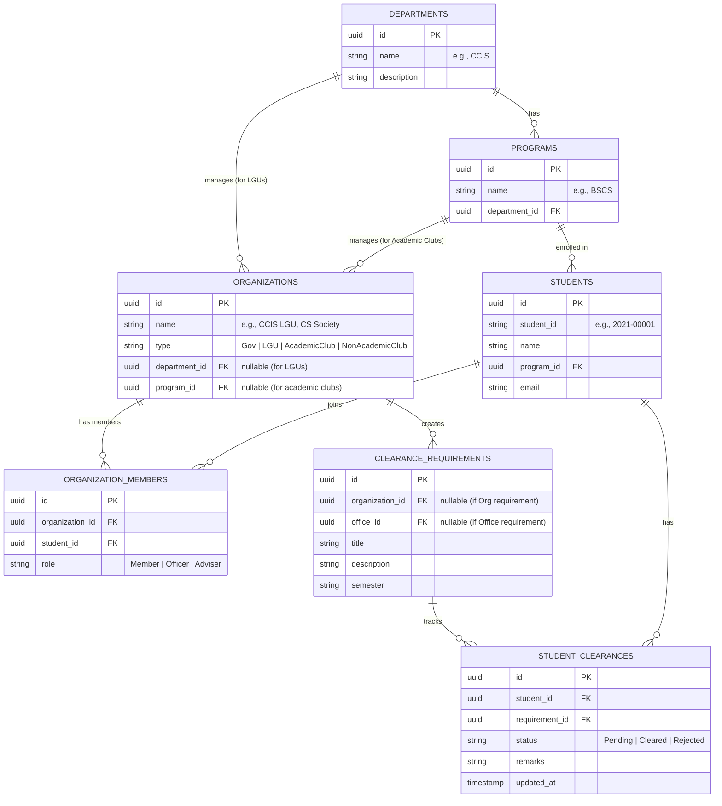

# Handling Organization Categories and Clearance Sessions

This document proposes the database schema and logical workflow to handle the different organization categories under the `org` role, and how students are associated with each type of organization for their clearance requirements.

---

## 1. Organization Types & Membership Logic

Under the `org` role, we have three main categories of organizations:

| Category | Subtype / Detail | Target Audience (Scope) | Membership Association Method |
| :--- | :--- | :--- | :--- |
| **Student Government** | Generic | **All Students** in the university. | **Automatic**: All students are assigned. |
| **LGU (Local Gov. Unit)** | Department-Specific | Students enrolled under a **specific department** (e.g., CCIS LGU for BSCS, BSIT). | **Automatic**: Checked via Student $\rightarrow$ Program $\rightarrow$ Department. |
| **Clubs (Academic)** | Program/Dept-Specific | Students enrolled in a **specific program/department** (e.g., CS Society for BSCS). | **Automatic / Optional Opt-out**: Based on the student's program/course. |
| **Clubs (Non-Academic)** | General / Inclusive | **Voluntary members** across any department/program. | **Manual / Explicit**: Tracked via a membership table. |

---

## 2. Proposed Database Schema (Relational Design)

To support this logic dynamically, we propose the following schema relationships (using PostgreSQL/Supabase conventions):



---

## 3. Logical Rules for Generating Student Clearance

When a new clearance cycle (semester/academic year) is initiated, the system generates `student_clearances` records dynamically. For a given student, the system identifies applicable requirements from the database using these rules:

### A. Student Government Requirements
* **Rule**: All active requirements created by organizations of type `Gov` are mapped.
* **SQL Logic / Filter**:
  ```sql
  SELECT id FROM clearance_requirements 
  WHERE organization_id IN (SELECT id FROM organizations WHERE type = 'Gov');
  ```

### B. LGU Requirements
* **Rule**: Map requirements from organizations of type `LGU` where `organization.department_id = student.program.department_id`.
* **SQL Logic / Filter**:
  ```sql
  SELECT cr.id FROM clearance_requirements cr
  JOIN organizations o ON cr.organization_id = o.id
  JOIN programs p ON o.department_id = p.department_id
  JOIN students s ON s.program_id = p.id
  WHERE o.type = 'LGU' AND s.id = :student_id;
  ```

### C. Academic Club Requirements
* **Rule**: Map requirements from organizations of type `AcademicClub` where `organization.program_id = student.program_id` (or department-wide clubs if program-level doesn't exist).
* **SQL Logic / Filter**:
  ```sql
  SELECT cr.id FROM clearance_requirements cr
  JOIN organizations o ON cr.organization_id = o.id
  JOIN students s ON s.program_id = o.program_id
  WHERE o.type = 'AcademicClub' AND s.id = :student_id;
  ```

### D. Non-Academic Club Requirements
* **Rule**: Map requirements from organizations of type `NonAcademicClub` ONLY if the student has a record in the `organization_members` table for that organization.
* **SQL Logic / Filter**:
  ```sql
  SELECT cr.id FROM clearance_requirements cr
  JOIN organizations o ON cr.organization_id = o.id
  JOIN organization_members om ON o.id = om.organization_id
  WHERE o.type = 'NonAcademicClub' AND om.student_id = :student_id AND cr.semester = :current_semester;
  ```

### E. Resolving Multiple Affiliations (Unified Clearance Checklist)
* **Concept**: Since a student belongs to multiple organizations at the same time (e.g., they belong to the Student Government, their department's LGU, their program's Academic Club, and potentially multiple Non-Academic Clubs), the system aggregates **all** applicable requirements into a single combined checklist for that student.
* **Aggregated SQL Logic / Filter**:
  When generating the student's checklist, we run a query that `UNION`s all the above requirements, ensuring all their affiliations are captured:
  ```sql
  -- Get Student Government requirements
  SELECT cr.id, cr.title, cr.organization_id FROM clearance_requirements cr
  JOIN organizations o ON cr.organization_id = o.id
  WHERE o.type = 'Gov' AND cr.semester = :current_semester

  UNION

  -- Get LGU requirements (based on student's program department)
  SELECT cr.id, cr.title, cr.organization_id FROM clearance_requirements cr
  JOIN organizations o ON cr.organization_id = o.id
  JOIN programs p ON o.department_id = p.department_id
  JOIN students s ON s.program_id = p.id
  WHERE o.type = 'LGU' AND s.id = :student_id AND cr.semester = :current_semester

  UNION

  -- Get Academic Club requirements (based on student's program)
  SELECT cr.id, cr.title, cr.organization_id FROM clearance_requirements cr
  JOIN organizations o ON cr.organization_id = o.id
  JOIN students s ON s.program_id = o.program_id
  WHERE o.type = 'AcademicClub' AND s.id = :student_id AND cr.semester = :current_semester

  UNION

  -- Get Non-Academic Club requirements (based on manual membership)
  SELECT cr.id, cr.title, cr.organization_id FROM clearance_requirements cr
  JOIN organizations o ON cr.organization_id = o.id
  JOIN organization_members om ON o.id = om.organization_id
  WHERE o.type = 'NonAcademicClub' AND om.student_id = :student_id AND cr.semester = :current_semester;
  ```
  This returns all requirements across all of the student's active affiliations for the semester.

---

## 4. Session Handling and Portal Mode Identification

When an officer or adviser logs in under the `org` role, their user session is associated with a specific `organization_id`. We determine the **Portal Mode (Inclusive vs. Exclusive)** dynamically at the session/API level.

### A. How the System Identifies the Org and Portal Mode
Upon sign-in, the system fetches the organization's profile from the database:
```sql
SELECT id, name, type, department_id, program_id 
FROM organizations 
WHERE id = :session_org_id;
```
Based on the `type`, the backend session/API context identifies the **Student Fetching Scope**:

| Org Type | Scope Classification | Student Fetching Query (SQL Logic) |
| :--- | :--- | :--- |
| **Gov** (Student Gov) | **Inclusive (Global)** | Fetches **all students** in the database. |
| **NonAcademicClub** | **Inclusive (Self-Managed)** | Fetches **only students** registered in `organization_members` for this `organization_id`. |
| **LGU** (Local Gov) | **Exclusive (Department)** | Fetches students where `student.program.department_id = org.department_id`. |
| **AcademicClub** | **Exclusive (Program/Dept)** | Fetches students where `student.program_id = org.program_id`. |

### B. Session State & Frontend Routing
1. **JWT / Context Claims**: The server includes `org_type`, `department_id`, and `program_id` in the authenticated session token or state context.
2. **Dynamic UI Adaptation**: The frontend `org` portal reads these session claims and adapts the dashboard layout:
   * **Inclusive View (Student Gov / Non-Academic)**: Shows global search/filters or club registration tools.
   * **Exclusive View (LGU / Academic)**: Automatically locks the views to their specific department/program (e.g., CCIS LGU is locked to CCIS students).

### C. Row-Level Security (RLS) & API Security
To prevent an organization from fetching unauthorized student lists, the database views or API endpoints enforce the scope classification checking:
```sql
-- Dynamic API query to fetch the student roster for an org officer
CREATE OR REPLACE FUNCTION get_org_students(org_id uuid)
RETURNS SETOF students AS $$
DECLARE
    org_type text;
    org_dept uuid;
    org_prog uuid;
BEGIN
    -- 1. Identify Org details
    SELECT type, department_id, program_id INTO org_type, org_dept, org_prog
    FROM organizations WHERE id = org_id;

    -- 2. Execute query based on scope type
    IF org_type = 'Gov' THEN
        RETURN QUERY SELECT * FROM students;
    ELSIF org_type = 'NonAcademicClub' THEN
        RETURN QUERY SELECT s.* FROM students s
        JOIN organization_members om ON s.id = om.student_id
        WHERE om.organization_id = org_id;
    ELSIF org_type = 'LGU' THEN
        RETURN QUERY SELECT s.* FROM students s
        JOIN programs p ON s.program_id = p.id
        WHERE p.department_id = org_dept;
    ELSIF org_type = 'AcademicClub' THEN
        RETURN QUERY SELECT * FROM students WHERE program_id = org_prog;
    END IF;
END;
$$ LANGUAGE plpgsql SECURITY DEFINER;
```

---

## 5. Proposed Action Plan

1. **Database Setup**: Implement the relational tables (`departments`, `programs`, `organizations`, `organization_members`, and update `students`).
2. **Backend / Edge Functions**:
   * Write a trigger or RPC (Remote Procedure Call) `generate_student_clearance(student_id)` that executes on semester start or student enrollment, applying the SQL logic outlined in Section 3 to populate `student_clearances`.
3. **Frontend UI Adaptation**:
   * Adapt the `org` portal so it queries metadata about the logged-in organization.
   * Provide a student roster page that queries students based on the organization's scope.
   * Adapt the `student` portal so their clearance checklists dynamically display the organization requirements tailored to their enrollment info.
